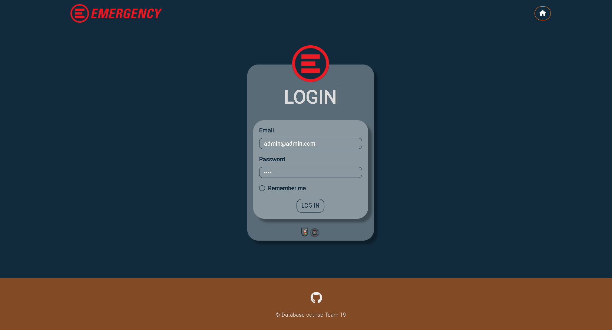
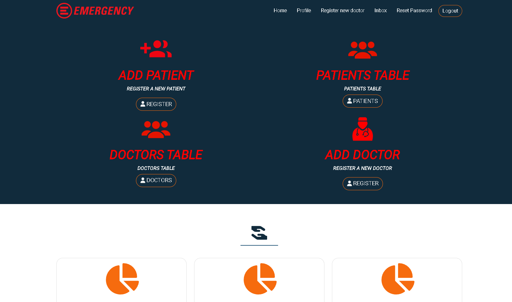
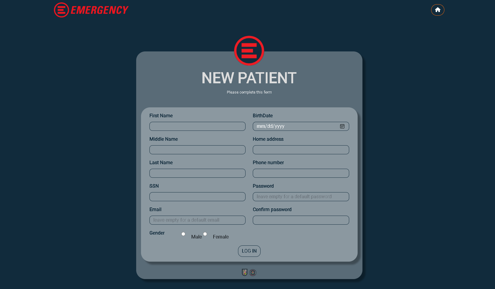
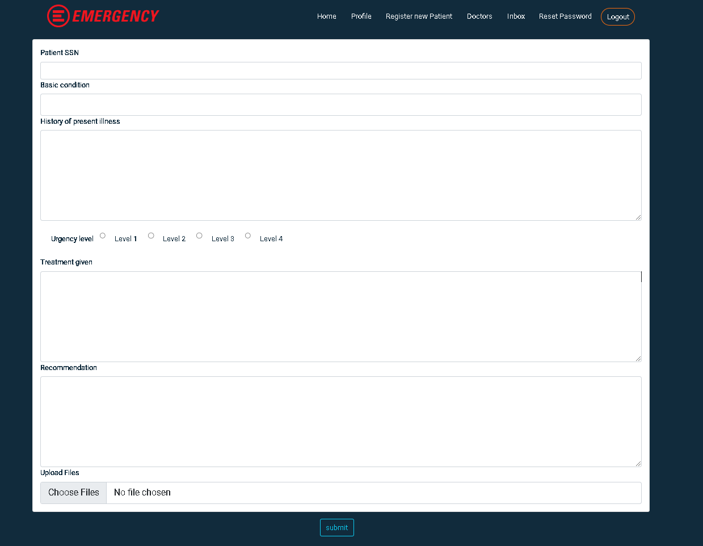
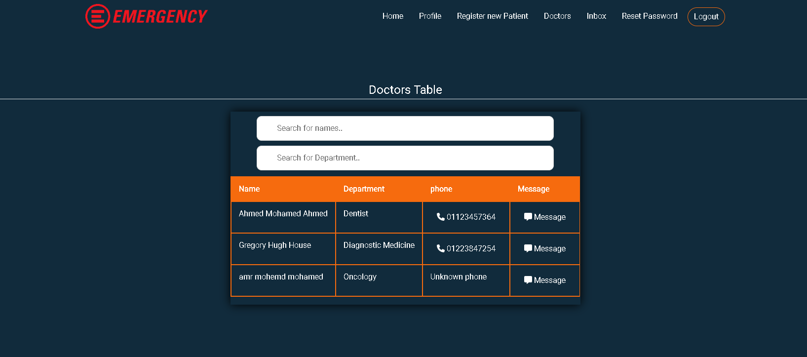

# Emergency-Department
the web app was made using:
1-flask: as a backend framework
2-html css javascript bootstrab for the frontend
3- SQL alchemy library using sqlite for the database

there is three different types of accounts:
1- admin
2- doctor
3- patient

##
The emergency room is the most sensitive department in the hospital. you can never predict when the patients visit the ER or what there condition wil be
The ER room and the doctors should work and be ready 24 hours 7 days a week
every patient belong to every doctor in the hospital, you can never predict when the patient is coming and which doctor and how many doctors should treat him
##

the admin have authority to: 
1- register new doctors
2- assign the working hours for each doctor
3- register new patients
4- create medical reports
5- edit his own medical report
6- message other doctors and recieve other messages
7- search for another doctor
8- search for a patient profile
9- search for patient reports

the doctor have authority to:
1- register new patients
2- create medical reports
3- edit his own medical report
4- message other doctors and recieve other messages
5- search for another doctor
6- search for a patient profile
7- search for patient reports

the patient have an email and password in order to be able to access his profile and get all of his medical reports

when you create an emergency report, the ssn is not required if the patient is anonymos but the doctor get a warning that he should register the patient as soon as possible and so the medical report will automatically be assigned to the patient
the instructions for using and installation IS BELLOW. 
##
Some screenshots

##

##

##

##

##

Admin:

admin@admin.com

Password:admin

Doctor:

house@doctor.com

Password:doctor

##

When patient a patient is registered and the (email and password) fields is left empty:

Defualt email: firstname+last 4 digit in ssn @hospital.com
Defualtpass: ssn

##

instructions to run this program:

OPEN CMD

1- clone  the project to an empty repositry

             
         git clone https://github.com/Amrmohamed090/Emergency-Department-Team19.git
              
       

2- go to the project directory, "the directory where you can find run.py"
    
        cd <project Directory>
    

3- add a virtual environment
  
        py -m venv env

note: if virtualenv is not installed in your device use "pip install virtualenv"

4- activate the virtual environment

        env\Scripts\activate
              
              note: IF you are using vscode and had an ERROR with 
              'ERROR:....cannot be loaded because running scripts is disabled on this system.'
              open powershell as adminstrator and type:
               "Set-ExecutionPolicy -ExecutionPolicy RemoteSigned -Scope LocalMachine"
               and confirm with YES
                    

5-install requirment packages

        pip install -r requirements.txt

6-run the app

        py run.py

  after installation every time you want to run the app you need to activate tha virtual environment before running the up
  

         env\Scripts\activate
         py run.py

  
            
